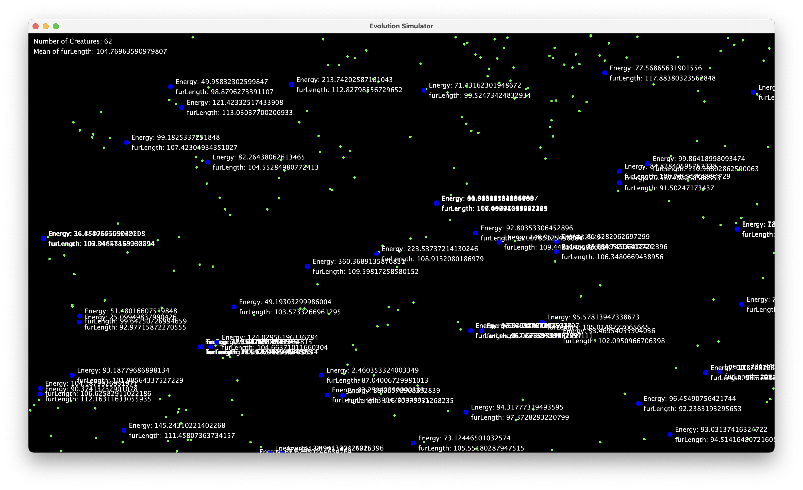

# Evolution Simulator

Evolution Simulator is a simple simulation program where creatures evolve over time by moving around and consuming food items.

## Features
## Features

- Creatures move randomly within the map.
- Food items are randomly generated on the map.
- Creatures can consume food items to gain energy.
- Creatures try to find the nearest food item and move towards it.

## Screenshot



### Prerequisites

- Java Development Kit (JDK) installed on your system
- IDE (e.g., IntelliJ IDEA, Eclipse) for Java development

### Installation

1. Clone the repository to your local machine:

    ```bash
    git clone https://github.com/yourusername/evolution-simulator.git
    ```

2. Open the project in your IDE.

3. Build and run the `App` class to start the simulation.

## Usage

- Once the simulation starts, you will see a window displaying the map.
- Creatures (represented by blue circles) will move randomly on the map.
- Food items will be generated on the map at regular intervals.
- Creatures will try to find and consume nearby food items to gain energy.

## Contributing

If you'd like to contribute to this project, please follow these steps:

1. Fork the repository.
2. Create a new branch (`git checkout -b feature/your-feature`).
3. Make your changes.
4. Commit your changes (`git commit -am 'Add some feature'`).
5. Push to the branch (`git push origin feature/your-feature`).
6. Create a new Pull Request.

## License

This project is licensed under the MIT License. See the [LICENSE](LICENSE) file for details.

## Note
- Physical Adaptations: A(t) could represent physical traits or adaptations that help the species survive in changing environmental conditions. For example, it could model the development of thicker fur in colder climates or the evolution of longer legs for faster running.

- Behavioral Traits: A(t) could represent behavioral characteristics that aid in survival, such as migration patterns, mating rituals, or foraging strategies. These traits could evolve over time as the species encounters new challenges in its environment.

- Genetic Diversity: A(t) could reflect the genetic diversity within the species population. Higher levels of genetic diversity might indicate a greater ability to adapt to changing conditions, while lower levels could lead to increased susceptibility to environmental threats.

- Reproductive Success: A(t) could represent the reproductive success of individuals within the population. This could include factors such as fertility rates, the number of offspring produced, or the survival rate of offspring to reproductive age.

- Resource Utilization: A(t) could model how efficiently the species utilizes available resources in its environment, such as food, water, or shelter. Changes in resource availability over time could drive adaptations in resource utilization behaviors.

- Resilience to Stressors: A(t) could represent the species' resilience to various environmental stressors, such as pollution, disease, or natural disasters. This could be measured by factors like population decline rates or recovery times following disturbances.

- Social Structure: A(t) could represent the structure and dynamics of social groups within the species. This might include factors such as dominance hierarchies, cooperative behaviors, or communication systems, which could influence survival and reproduction.

- Evolutionary Fitness: A(t) could be a composite measure of overall evolutionary fitness, incorporating various traits and behaviors that contribute to survival and reproductive success in a given environment.
